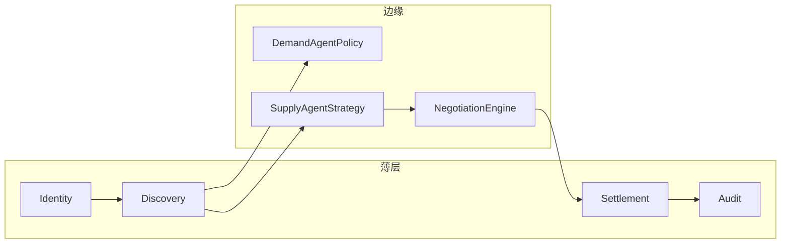

# C4 Level 3 — 组件（Go API 薄协调层）

> 组件划分：薄层模块 + 边缘策略代理 | 最后更新: 2026-06-26

## 薄协调层组件

| 组件 | 代码路径 | 职责 |
|------|----------|------|
| **Identity** | `user_service`, `auth_handler` | JWT、角色、用户 CRUD |
| **Discovery** | `matching_handler`, `dispatch_service` | 硬约束候选（R0 dispatch 过渡） |
| **Settlement** | `order_service`, `subscription_service` | 订单/订阅缔约记录 |
| **Audit** | `agent_call_log`, admin agents/logs | Agent 调用审计 |
| **ComplianceGate** | *规格见 compliance-gates* | 疲劳二元硬拒（未实现） |

## 厚边缘组件（经 API 暴露）

| 组件 | 代码路径 | 职责 |
|------|----------|------|
| **DemandAgentPolicy** | `enterprise_service`, `recurring_trip_service` | B 端政策、周期 Intent |
| **SupplyAgentStrategy** | `matching_service`, driver matching offers | Offer/Counter |
| **NegotiationEngine** | `matching_service` | 多轮收敛（R0 简化） |
| **IntentParser** | `ai-service` | LLM+ASR Intent 声明 |
| **AgentBridge** | MCP + `/api/v1/agent/*` | 外部 Agent 互操作 |

## Handler 映射

| Handler | 路由组 | 层级 |
|---------|--------|------|
| auth_handler | `/api/v1/auth` | 薄层 |
| matching_handler | `/passenger|driver/matching` | 边缘协商 |
| passenger_handler | orders, ai, recurring | 混合 |
| agent_handler | `/api/v1/agent` | 边缘 |
| admin_handler | `/api/v1/admin` | 薄层运维 |
| map_handler | `/api/v1/maps` | 基础设施 |

## 管理后台页面映射

| 页面 | 路由 | 层级 | 备注 |
|------|------|------|------|
| 企业客户 | `/enterprise` | 需求 Agent | ✅ |
| 订阅管理 | `/subscription` | 供给 SaaS | ✅ |
| 信誉分 | `/trust-scores` | ⚠️ 过渡 | ADR-004 待重构 |
| 智能体 | `/agents` | Agent 审计 | ✅ |
| 地图监控 | `/monitor` | R0 实时过渡 | WS 追踪 |

## 组件图

---

*Level 4 代码级可选；本 PRD 不展开*
