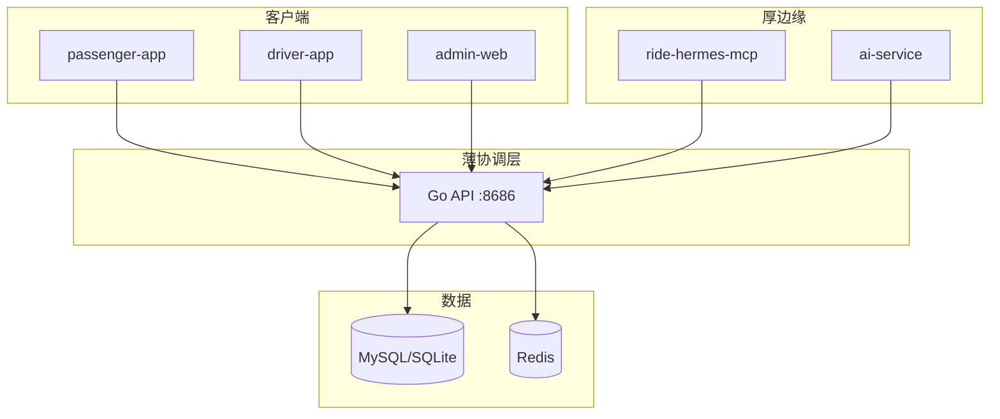

# C4 Level 2 — 容器

> 薄协调层 + 厚边缘层 | 最后更新: 2026-06-26

## 容器清单

| 容器 | 技术 | 层级 | 职责 |
|------|------|------|------|
| **Go API** | Go 1.21+ Gin GORM | 薄协调层 | 身份、硬约束发现、缔约记录、审计、限流 |
| **admin-web** | React 18 Ant Design | 薄层运维 UI | 用户/企业/订阅/事实监控（R0） |
| **passenger-app** | Flutter | 边缘触达 | Intent 声明、周期出行、Commit 确认 |
| **driver-app** | Flutter | 边缘触达 | Offer/Counter、上线日历、行程状态 |
| **ai-service** | Python FastAPI | 厚边缘 | LLM 意图、ASR、多轮对话 |
| **ride-hermes-mcp** | TypeScript MCP | 厚边缘 | 10 工具 Agent 接入 |
| **MySQL / SQLite** | 关系库 | 持久化 | 18+ 实体（见 migrate.go） |
| **Redis** | 缓存 | 基础设施 | GEO 发现、限流、会话 |

## 容器图



## 数据流（目标态）

```
Intent(需求) → 发现(硬约束,无序) → Offer/Counter(边缘) → Commit(双签) → 执行 → Settle
```

R0 过渡：`POST /passenger/orders` + `dispatch_service` 并行存在，文档见 [`api/overview.md`](../api/overview.md)。

## 核心实体（A2A 归类）

| 实体 | A2A 语义 |
|------|----------|
| matching_demands / recurring_trips | Intent |
| matching_offers | Offer |
| orders (post-confirm) | Commit / 执行 |
| subscriptions / enterprise_* | 需求 Agent 政策与批量 |
| agent_credentials / agent_call_log | Agent 互操作审计 |
| trust_scores / evaluations | ⚠️ R0 过渡；目标为边缘解读中心事实 |

## ADR 映射

| ADR | 容器影响 |
|-----|----------|
| ADR-002 | Go API 双轨：matching + dispatch |
| ADR-004 | admin trust-scores 过渡 |
| ADR-006 | MCP + Agent REST 并列 |

---

*容器数量与代码同步于 2026-06-26*
