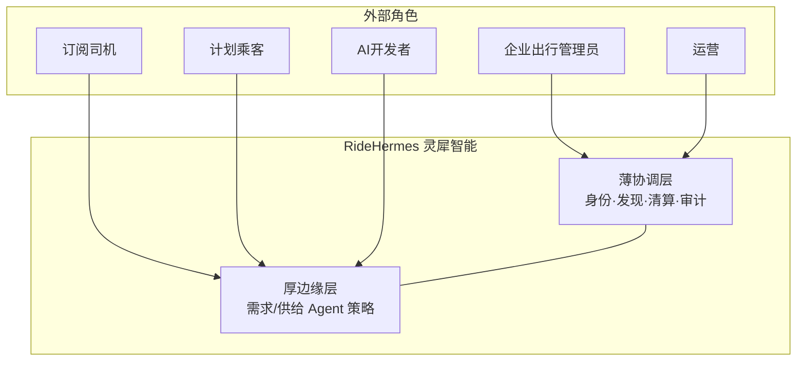

# C4 Level 1 — 系统上下文

> 计划性出行 · AI 原生 · A2A 边缘协商 | 最后更新: 2026-06-26

## 系统

**灵犀智能 / RideHermes** — 薄协调层提供协议与信任，厚边缘 Agent 完成报价、协商与缔约。

**场景边界**：计划性出行（分钟～天）；R0 过渡态含实时派单能力（见 ADR-002）。

## 外部角色

| 角色 | 说明 | 主要操作 |
|------|------|----------|
| **企业/酒店出行管理员** | 需求 Agent 委托方 | 周期 Intent、政策、批量排程 |
| **订阅司机 / 车队** | 供给 Agent | Offer/Counter、可用日历 |
| **计划出行乘客** | C 端用户 | Intent 声明、确认 Commit |
| **运营人员** | 薄层运维 | 用户/订单/事实审计、合规配置 |
| **AI 集成开发者** | 渠道 Agent | MCP / Agent REST |
| **监管 / OEM 车联网** | 外部（远期） | 派生事实、跨平台时长（R2+） |
| **Robotaxi 供给** | 外部（R2） | ODD 内 Offer、人机接力 |

## 上下文图

## 外部依赖

| 服务 | 用途 | 风险 |
|------|------|------|
| 高德地图 | POI、路线、地理编码 | 中 |
| LLM/ASR 提供商 | ai-service 意图与语音 | 中 |
| 短信（可选） | 验证码 | 低 |

---

*参见 [`product/vision.md`](../product/vision.md)、[`product/decisions.md`](../product/decisions.md)*
